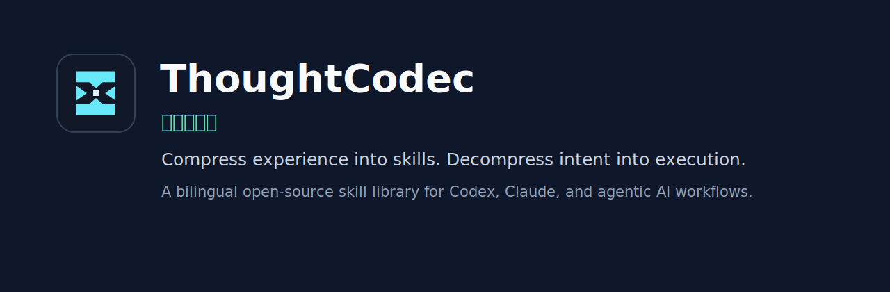
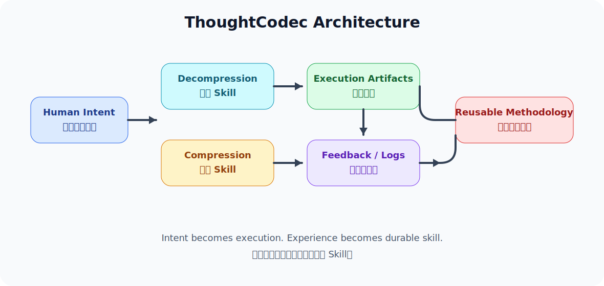

# ThoughtCodec 思维编解码

[](LICENSE)




**ThoughtCodec（思维编解码）** 是一个中英双语开源 Skill 库，用来把人的抽象意图“解压”为可执行的 AI 工作流，再把反复实践中的经验“压缩”为可复用的 Skill。

English version: [README.md](README.md).

## 项目为什么存在

大多数 AI 工作流仍然把模型当作一次性问答工具。ThoughtCodec 采用另一种视角：AI 协作是一套双向编解码系统。

- **解压：** 将高密度想法、策略、约束展开成计划、SOP、代码结构、架构图和执行清单。
- **压缩：** 从纠错、日志、重复决策和完成稿中提取可复用规则，并沉淀为长期可调用的 Skill。

项目第一版提供 5 个适用于 Codex、Claude 及类似智能体助手的实用 Skill。

## 文档

- [English docs](docs/en/README.md)
- [简体中文文档](docs/zh-CN/README.md)
- [Roadmap / 路线图](ROADMAP.md)

## Skill 列表

| Skill | 类型 | 适用场景 |
| --- | --- | --- |
| [架构级脚手架生成器](skills/architecture-scaffolding/SKILL.zh-CN.md) | 解压 | 将业务逻辑转化为架构、数据模型、API 契约和代码结构。 |
| [标准作业程序实例化引擎](skills/sop-instantiation/SKILL.zh-CN.md) | 解压 | 将宏观目标转化为带里程碑和检查点的具体 SOP。 |
| [规则与提示词迭代器](skills/rule-prompt-optimizer/SKILL.zh-CN.md) | 压缩 | 将反馈、纠错和对话轨迹转化为可复用提示词规则。 |
| [代码与组件重构器](skills/code-abstraction-encapsulation/SKILL.zh-CN.md) | 压缩 | 将重复或混乱的代码转化为可复用组件和工程规则。 |
| [个人方法论引擎](skills/personal-methodology-engine/SKILL.zh-CN.md) | 闭环 | 将解压与压缩合并为个人工作系统。 |

每个 Skill 都包含英文与简体中文版本：

```text
skills/<skill-id>/SKILL.md
skills/<skill-id>/SKILL.zh-CN.md
```

每个 Skill 也在 `skills/<skill-id>/examples/` 下包含一个实用示例。

## 系统架构



ThoughtCodec 的公共基础包括：

- [解压与压缩协议](docs/zh-CN/protocols.md)
- [四层自进化模型](docs/zh-CN/protocols.md#四层自进化模型)
- [智能体闭环](docs/zh-CN/protocols.md#智能体闭环)

## 仓库结构

```text
.
|-- assets/              # Logo、Banner、架构图和社交预览图
|-- catalog/             # 机器可读的双语 Skill 索引
|-- docs/
|   |-- en/              # 英文项目文档
|   `-- zh-CN/           # 简体中文项目文档
|-- examples/            # 跨 Skill 的工作流示例
|-- scripts/             # 校验与维护脚本
`-- skills/              # 每个 Skill 一个文件夹
```

## 快速开始

1. 选择与你任务匹配的 Skill。
2. 阅读英文或中文 `SKILL` 文件。
3. 将 Skill 指令粘贴到 Codex、Claude 或其他智能体助手中。
4. 提供所需输入。
5. 审核输出，并记录有价值的修改意见，用于后续压缩为规则。

本地运行结构检查：

```bash
bash scripts/validate_structure.sh
```

## 视觉资产

本仓库已经包含开源项目常用配图：

- [Logo](assets/logo.svg)
- [README Banner](assets/banner.svg)
- [GitHub Social Preview](assets/social-preview.svg)
- [可直接上传的 Social Preview PNG](assets/social-preview.png)
- [单色 Logo](assets/logo-mono.svg)
- [系统架构图](assets/diagrams/architecture.svg)
- [解压与压缩流程图](assets/diagrams/decompression-compression.svg)
- [智能体闭环图](assets/diagrams/agentic-loop.svg)

## 状态

ThoughtCodec 当前是初始公开预览版本。项目结构、首批 5 个 preview 状态 Skill、双语文档、示例、视觉资产和校验脚本已经就位。后续可以继续补充集成、测试和更多领域 Skill。

## 许可证

本项目使用 [MIT License](LICENSE) 开源。
