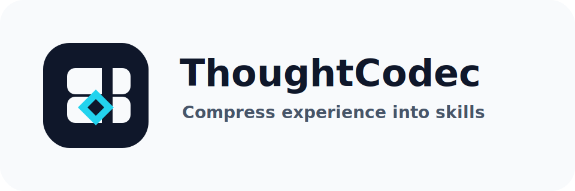
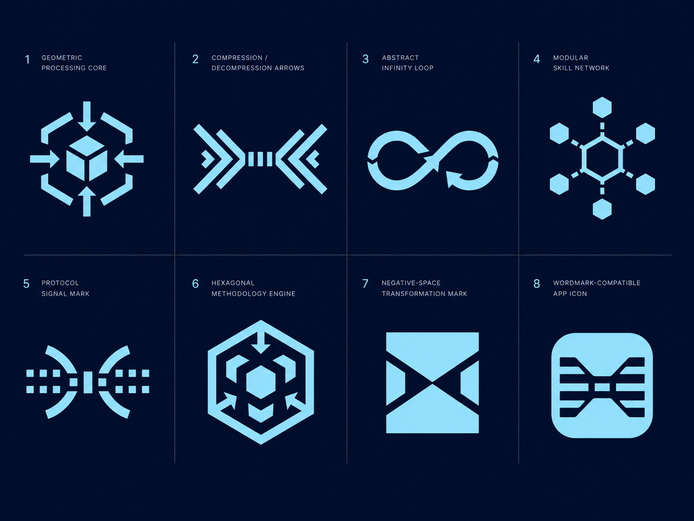

# ThoughtCodec Logo Review Board

This board is for choosing the next stable logo direction before GitHub publication. It intentionally keeps the routes simple and vector-first so they can be evaluated for silhouette, small-size behavior, and system fit.

The current review board is not final. Earlier logo attempts failed because they looked like polished posters or complex concept diagrams rather than durable open-source identity assets. See [logo-failure-analysis.md](logo-failure-analysis.md) before accepting a route.

## Direction 01: Codec Core

- Family: symbol
- Strength: precise infrastructure feel
- Risk: slightly abstract without the wordmark

## Direction 02: Bidirectional Flow

- Family: symbol
- Strength: directly suggests compression/decompression
- Risk: flow marks are common in software branding

## Direction 03: Modular Grid

- Family: geometric
- Strength: strong small-size performance; fits skill library and reusable modules
- Risk: less literal about codec, more focused on modular knowledge

## Direction 04: Signal Mark

- Family: tech
- Strength: protocol and agent-system feel
- Risk: may resemble analytics or signal-processing products

## Direction 05: Wordmark First

- Family: wordmark
- Strength: strongest for README and documentation headers
- Risk: needs a separate favicon mark

## Direction 06: Processing Flow

- Family: symbol
- Strength: closest to the accepted Gemini direction: inputs converge into a geometric processing core, outputs branch outward
- Risk: needs a reduced variant for very small favicon sizes

## Web Generation Round

The next exploration step used [web-image-generation-prompt.md](web-image-generation-prompt.md) in ChatGPT web image generation. The generated board is saved as a reference image:

The output is treated as a visual route board only. The final repository logo must still be redrawn as clean SVG and pass the criteria in [logo-review-criteria.md](logo-review-criteria.md).

## Web Board Assessment

- Route 01 has a useful core metaphor, but the cube and arrows are still too literal and detailed for favicon use.
- Route 02 communicates compression and decompression clearly, but it is horizontal and close to common transfer/flow marks.
- Route 03 is recognizable, but infinity marks are overused and weakly tied to reusable AI skills.
- Route 04 reads as a molecule or network product rather than a codec or methodology engine.
- Route 05 is clean but too abstract to carry the project identity alone.
- Route 06 has the strongest narrative fit, but its internal arrows and hexagonal structure remain too complex at small sizes.
- Route 07 has the strongest silhouette, simplest geometry, and best small-size potential.
- Route 08 is app-icon-friendly, but the internal stripes risk collapsing and the rounded square dominates the identity.

## Recommendation

Use **Web Route 07: Negative-Space Transformation Mark** as the final SVG mother route. The production asset has been redrawn as a simple negative-space codec aperture in `assets/logo.svg`, with `assets/logo-mono.svg`, `assets/banner.svg`, and `assets/social-preview.svg` synchronized to the same identity system.
